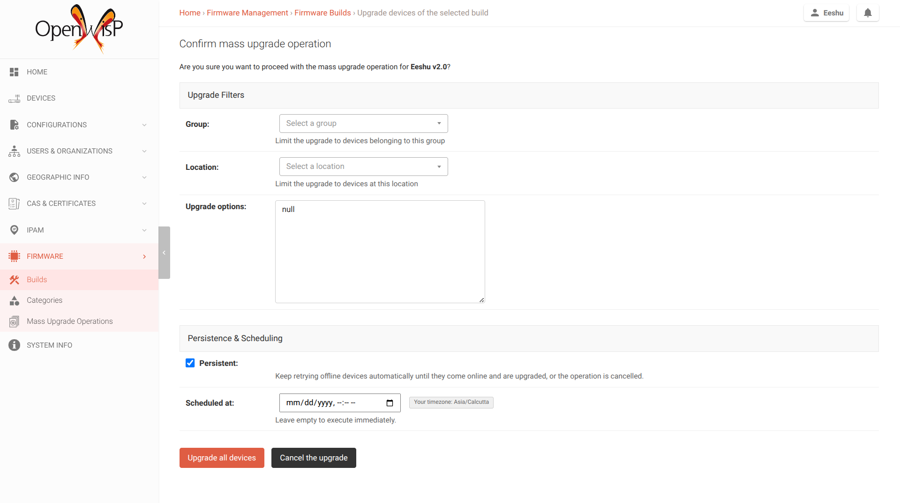
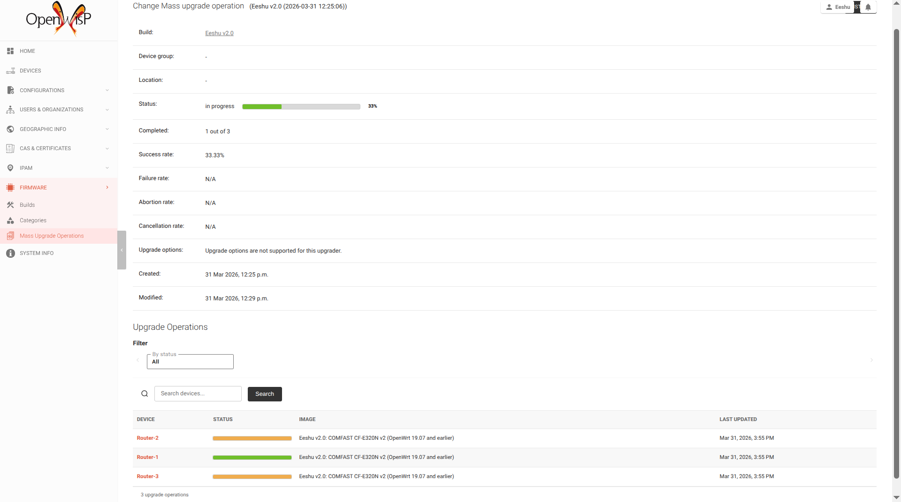

# GSoC 2026 Prototype: Persistent Firmware Upgrades

**Branch:** `feature/persistent-upgrades`
**Applicant:** Eeshu Yadav
**Related issue:** [#379](https://github.com/openwisp/openwisp-firmware-upgrader/issues/379)

## What this shows

When a mass upgrade hits an offline device, instead of permanently failing, the operation goes to `pending` status and retries automatically via Celery Beat.

- `_recoverable_failure_handler` sets `status="pending"` when `persistent=True`
- `_calculate_next_retry()` computes exponential backoff with jitter
- `check_pending_upgrades` Celery Beat task finds overdue pending ops
- `retry_pending_upgrade` uses atomic `filter().update()` to prevent duplicate retries
- `calculate_and_update_status()` and `progress_report` exclude pending from completed count
- Admin confirmation page has `persistent` checkbox and `scheduled_at` datetime picker
- Pending operations render as orange in the batch detail progress bars

## Tests

3 tests covering the persistence loop:

```
test_persistent_upgrade_goes_pending_on_offline_device
test_check_pending_upgrades_dispatches_due_operations
test_retry_pending_upgrade_idempotent
```

Run:
```bash
TESTING=1 python ./tests/manage.py test openwisp_firmware_upgrader.tests.test_models -k pending --settings openwisp2.settings --pythonpath tests --noinput
```

## Screenshots

**Confirmation page with Persistence & Scheduling:**



**Batch detail with mixed statuses (green=success, orange=pending):**



## How to run locally

```bash
git clone https://github.com/Eeshu-Yadav/openwisp-firmware-upgrader.git
cd openwisp-firmware-upgrader
git checkout feature/persistent-upgrades
pip install -e .
cd tests
python manage.py migrate --settings openwisp2.settings
python manage.py createsuperuser --settings openwisp2.settings
python manage.py runserver --settings openwisp2.settings
```

Then: Admin → Firmware → Builds → select a build → "Mass-upgrade devices" → Go.

## Files changed

- `openwisp_firmware_upgrader/base/models.py` — persistent/retry_count/next_retry_at fields, _recoverable_failure_handler, calculate_and_update_status, progress_report, cancel()
- `openwisp_firmware_upgrader/tasks.py` — retry_pending_upgrade, check_pending_upgrades
- `openwisp_firmware_upgrader/tests/test_models.py` — 3 new tests
- `openwisp_firmware_upgrader/migrations/0018_upgradeoperation_persistent.py`
- `openwisp_firmware_upgrader/admin.py` — persistent checkbox, scheduled_at picker
- `openwisp_firmware_upgrader/templates/admin/upgrade_selected_confirmation.html`
- `openwisp_firmware_upgrader/static/firmware-upgrader/js/upgrade-utils.js` — pending status support
- `openwisp_firmware_upgrader/static/firmware-upgrader/css/batch-upgrade-operation.css` — pending color
- `openwisp_firmware_upgrader/websockets.py` — exclude pending from completed count
